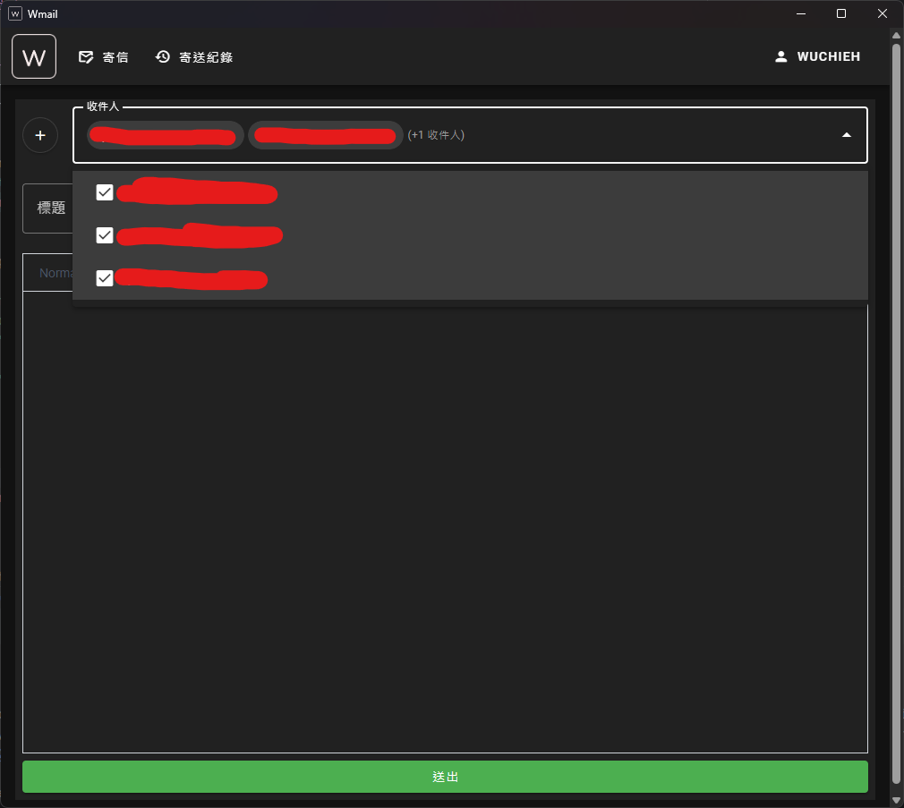

# Wmail - Email寄送應用
* 簡單的UI設計
* 支援多平台 (Windows, Android, Web)
* 可查看寄送紀錄

# Installation
```shell
git clone https://github.com/Wuchieh/wmail.git
cd wmail
```
## 桌面端
```shell
go install github.com/wailsapp/wails/v2/cmd/wails@latest
go mod tidy
wails build
```
## Android
```shell
cd frontend
pnpm install
pnpm install @capacitor/assets --save-dev
pnpm run build
npx cap init [appName] [appId]
npx cap add android
npx cap sync
npx capacitor-assets generate
npx cap open android
```
在 AndroidManifest.xml 文件新增
```xml
<intent-filter>
    <action android:name="android.intent.action.VIEW" />
    <category android:name="android.intent.category.DEFAULT" />
    <category android:name="android.intent.category.BROWSABLE" />
    <data android:scheme="@string/custom_url_scheme" />
</intent-filter>
```
```text
修改完成後就可以使用 Android Studio 打包應用成 apk 了
```
# 展示





